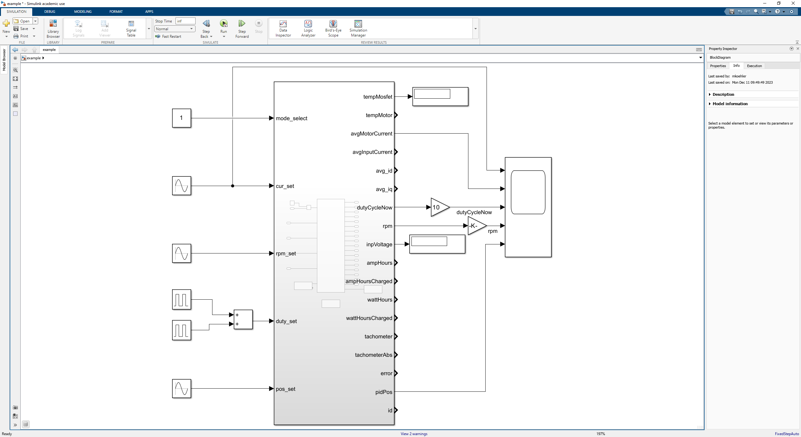
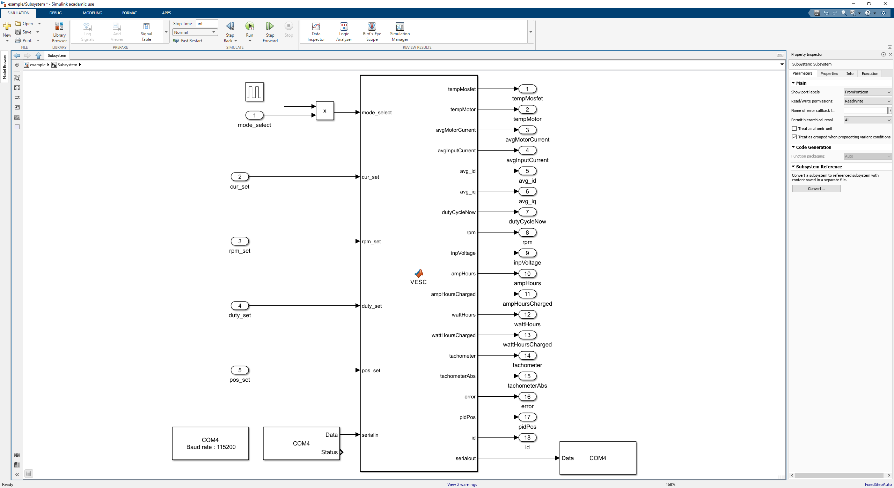

# VESC Simulink Matlab Interface

Version 1.0, 04/2024 

## MATLAB

The provided files for the usage in the Mathworks MATLAB environment can be found in the folder Matlab.

## Simulink

The example Simulink-Model can be found in the main directory. Feel free to edit the model to fit your needs, while it's necessary to have the "simulation" set to fixed time step and a simulation pacing of 1.

To be able to establish communication to the connected VESC, the COM-Port has to be set correctly. To do so, double-klick the interface block and change the Port in the 3 Serial communication blocks accordingly.

## Compatibility

This interface has only been tested on Windows.
